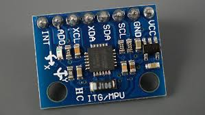
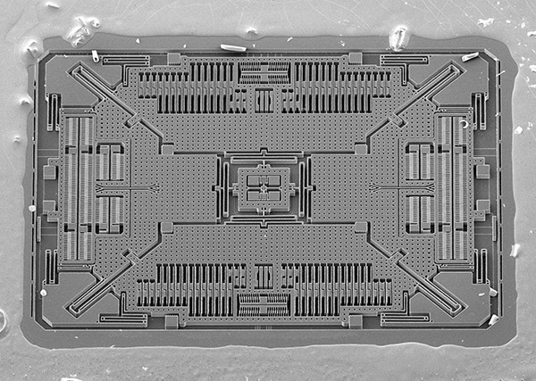
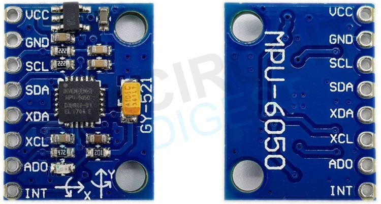
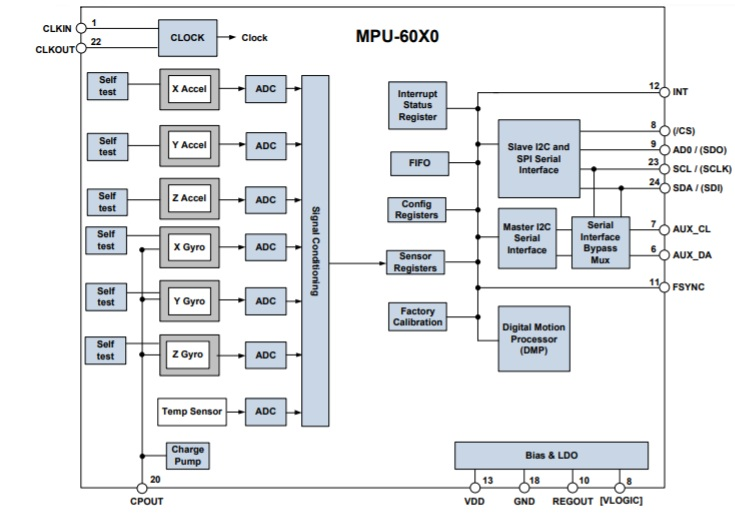
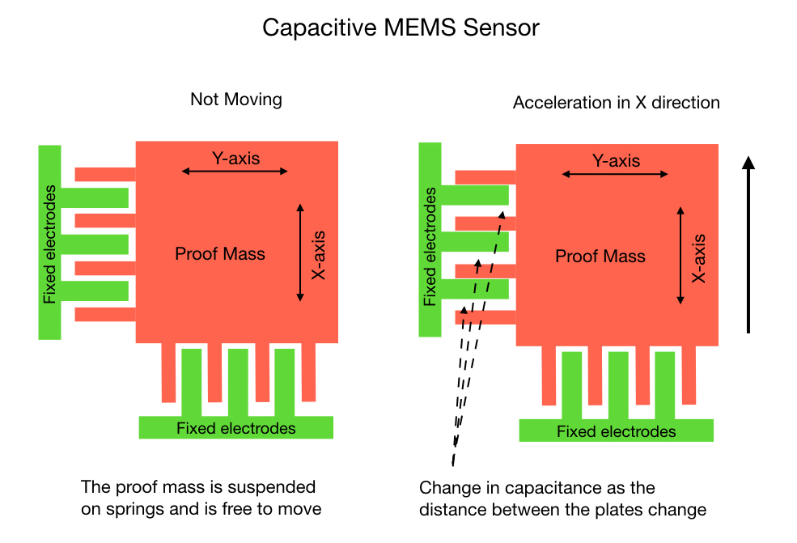

# MPU6050 6-Axis Motion Sensor 

## Table of Contents
- [Overview](#overview)
- [Hardware Setup](#hardware-setup)
- [Working Principle](#working-principle)
  - [Accelerometer Working](#1-accelerometer-working)
  - [Gyroscope Working](#2-gyroscope-working)
  - [Sensor Fusion](#3-sensor-fusion)
  - [Output](#4-output)
- [Software Usage](#software-usage)
  - [Functions Used](#functions-used)
  - [Angle Calculation](#angle-calculation)
    - [Accelerometer Angle](#void-compute_acce_angleint16_t-ax-int16_t-ay-int16_t-az-float-acce_angle)
    - [Gyroscope Angle](#void-compute_gyro_angleint16_t-gx-int16_t-gy-int16_t-gz-float-dt-float-gyro_angle)
  - [Sensor Fusion Algorithm(Complementary-filter)](#sensor-fusion)
  - [Main Function](#main-function)
  - [Calibration Details](#calibration)
- [Running](#running)
- [Applications](#applications)
 

---

## Overview

 |  |  | 
 |--------------------------------|----------------------------|

The MPU6050 is a 6-axis Motion Processing Unit (MPU) that combines:

### **Accelerometer** 
- Measures linear acceleration (including gravity)

The accelerometer measures static acceleration (like gravity) and dynamic acceleration (motion).
When the sensor is flat, only gravity acts on the Z-axis.
When tilted, the projection of gravity shifts across X, Y, and Z axes.
This gives an estimate of the absolute orientation of the device.

### **Gyroscope** 

- Measures angular velocity (rotation rate)

The gyroscope measures rotational velocity — how fast the sensor is rotating about each axis.
By integrating the rate of change over time, the gyroscope provides smooth short-term angle changes.
However, small errors accumulate over time (known as drift).

### **Complementary filter**

- **Accelerometer alone**: Too noisy for smooth control
- **Gyroscope alone**: Drifts away from true orientation


Complementary filter fuses both sensors using weighted average:

```
angle = 0.995 × (angle + gyro_rate × dt) + 0.005 × accel_angle
        └─────────── smooth ───────────┘   └── corrects drift ──┘
```
### Key Specifications
- **I2C Interface** - Communicates via I2C protocol (address: 0x68 or 0x69)
- **16-bit ADC** - High-resolution sensor readings
- **Configurable Ranges**:
  - Accelerometer: ±2g, ±4g, ±8g, ±16g
  - Gyroscope: ±250°/s, ±500°/s, ±1000°/s, ±2000°/s

---

## Hardware Setup

|  |  |
|:-----------------------------:|:----------------------------------------------:|
| MPU6050 MODULE         | MPU6050 Block Diagram                        |


### **Pin Description**
| Pin | Description | 
|------|-------------
| VCC | Power input (3.3V ) | 
| GND | Ground | 
| SCL | I²C clock |
| SDA | I²C data | 
| XDA, XCL | Auxiliary I²C pins |
| AD0 | Address select | 
| INT | Interrupt output |
---


## Working Principle


The **MPU6050** combines a **3-axis accelerometer** and a **3-axis gyroscope** on the same silicon die. Together, they detect both **linear motion** and **rotational motion**, enabling full 6-DOF (Degrees of Freedom) motion tracking.

### **1. Accelerometer Working**



- The accelerometer is a **MEMS (Micro-Electro-Mechanical System)** device.
- It contains microscopic structures suspended by springs.
- When the sensor moves or tilts, these structures experience deflection due to acceleration or gravity.
- This deflection changes the capacitance between the plates, which is converted into a digital acceleration value through an internal ADC.

### **2. Gyroscope Working**


- The gyroscope measures **angular velocity** based on the **Coriolis effect**.
- Inside the MEMS structure, a tiny vibrating mass experiences a force when the device rotates.
- The direction and magnitude of this Coriolis force are proportional to the rate of rotation.
- The MPU6050 senses this as a change in capacitance and converts it into angular velocity readings (°/s).

### **3. Sensor Fusion**
- we manually fuse the accelerometer and gyroscope outputs using a **complementary filter**.
- The fusion ensures stable, real-time angle estimation with minimal noise and drift.

### **4. Output**
- The processed data gives **roll**,**pitch** and **yaw** angles.

---

## Software Usage

### Functions Used

The header declares all public functions with detailed documentation:

1. **Initialization Functions**
   - `i2c_master_init()` - Setup I2C bus
   - `enable_mpu6050()` - Configure MPU6050

2. **Low-Level Reading**
   - `mpu6050_read_acce()` - Read raw accelerometer bytes
   - `mpu6050_read_gyro()` - Read raw gyroscope bytes
   - `combine_msb_lsb_raw_data()` - Convert bytes to integers

3. **Angle Computation**
   - `compute_acce_angle()` - Calculate tilt from accelerometer
   - `compute_gyro_angle()` - Calculate rotation from gyroscope

4. **High-Level Functions**
   - `read_mpu6050_raw()` - Read both sensors
   - `complementary_filter()` - Fuse sensor data
   - `read_mpu6050()` - Main function (ready to use)

5. **Calibration**
   - `calibrate_mpu6050()` - Auto-calibrate sensor offsets
   - `avg_sensors()` - Helper for averaging readings

---


### Angle Calculation

#### `void compute_acce_angle(int16_t ax, int16_t ay, int16_t az, float *acce_angle)`
Calculates roll and pitch from accelerometer.

**Parameters**:
- `ax, ay, az`: Raw accelerometer values
- `acce_angle`: Output array[2] - [roll, pitch] in degrees

**Math**:
```
roll = atan2(ay, √(ax² + az²)) × 57.296°
pitch = atan2(-ax, √(ay² + az²)) × 57.296°
```

---

#### `void compute_gyro_angle(int16_t gx, int16_t gy, int16_t gz, float dt, float *gyro_angle)`
Calculates angle change from gyroscope.

**Parameters**:
- `gx, gy, gz`: Raw gyro values
- `dt`: Time elapsed since last reading (seconds)
- `gyro_angle`: Output array[2] - angular displacement

**Math**:
```
gx_dps = gx / 131          (convert to degrees/second)
angle_change = gx_dps × dt  (degrees rotated)
```

---

### Sensor Fusion

#### `void complementary_filter(int16_t *acce_raw_value, int16_t *gyro_raw_value, float *complementary_angle, float *mpu_offset)`
Fuses accelerometer and gyroscope data.

**Parameters**:
- `acce_raw_value`: Raw accelerometer data
- `gyro_raw_value`: Raw gyroscope data
- `complementary_angle`: Filtered output (updated in place)
- `mpu_offset`: Calibration offset to apply

**Algorithm**:
```
On first call: Initialize angle from accelerometer
On subsequent calls:
    1. Calculate dt (time since last call)
    2. Get angles from both sensors
    3. Apply filter:
       angle = 0.995(angle + gyro_Δ) + 0.005(accel_angle)
```

---

### Main Function

#### `esp_err_t read_mpu6050(float *euler_angle, float *mpu_offset)`
**THE** function to use - handles everything.

**Parameters**:
- `euler_angle`: Output array[2] for roll and pitch (degrees)
- `mpu_offset`: Calibration offset (from `calibrate_mpu6050()`)

**Returns**: `ESP_OK` on success

**Example**:
```c
float angles[2];
float offset[2] = {0, 0};  // Or from calibration

while (1) {
    read_mpu6050(angles, offset);
    printf("Roll: %.2f°, Pitch: %.2f°\n", angles[0], angles[1]);
    vTaskDelay(pdMS_TO_TICKS(10));
}
```

---

### Calibration

#### `esp_err_t calibrate_mpu6050(void)`
Automatically calibrates sensor offsets.

**Returns**: `ESP_OK` if calibrated, `ESP_FAIL` if exceeds attempts

**Requirements**: Device must be stationary and level during calibration!

**Process**:
1. Takes multiple readings
2. Iteratively adjusts offsets to minimize error
3. Gyro target: 0 on all axes
4. Accel target: X=0, Y=0, Z=16384 (1g)
5. Stops when all axes within ±5 units or after 20 attempts

**Example**:
```c
ESP_LOGI(TAG, "Calibrating... keep device still!");
if (calibrate_mpu6050() == ESP_OK) {
    ESP_LOGI(TAG, "Calibration successful!");
} else {
    ESP_LOGW(TAG, "Calibration failed - using defaults");
}
```

**Internal Storage**: Offsets stored in static variables, automatically applied in subsequent reads.

---
## Running
- Navigate to examples directory.
```bash
cd /examples/mpu6050
```
- Setup ESP-IDF Environment
```bash
source $IDF_PATH/export.sh
```
- Build the project
```bash
idf.py build
```
- Flash to the ESP-32 device and monitor output
```bash
idf.py flash monitor
```

## Applications

###  **Robotics**
- Balancing robots (e.g., self-balancing cars)
- Robotic arm stabilization
- Motion tracking and gesture control

### **Drones & UAVs**
- Attitude estimation (roll, pitch, yaw)
- Flight stabilization and auto-leveling

### **Gaming and VR**
- Head and hand motion tracking
- Orientation sensing in controllers

### **Industrial Uses**
- Vibration analysis
- Machinery tilt detection and monitoring


